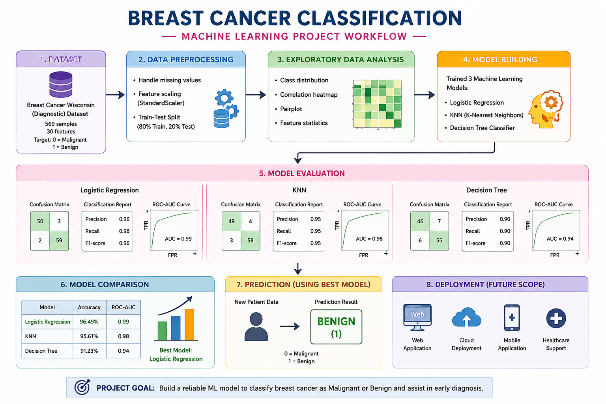

# Breast-cancer-Classification-project

<p align="center">
  
</p>

### 📌 Project Overview

This project uses Machine Learning classification techniques to classify breast cancer cases into two categories:

- 0 → Malignant
- 1 → Benign

The project compares multiple classification models and evaluates their performance using accuracy, confusion matrix, classification report, and ROC-AUC score.

#

### 📊 Dataset

The project uses the **Breast Cancer Wisconsin (Diagnostic) Dataset.**

- Total Records: 569
- Total Features: 30
- Target: Breast cancer diagnosis
- Classes: Malignant and Benign

The dataset contains numerical measurements extracted from breast cell nuclei.

#

### 🧹 Data Preprocessing

The dataset is divided into:

- **X**: Input features
- **y**: Target variable

The data is split into:

- **80% Training Data**
- **20% Testing Data**

```StandardScaler``` is used to standardize the feature values before applying the models.

#

### 📈 Exploratory Data Analysis

EDA is performed to understand the dataset and relationships between features.

Main visualizations include:

- Feature distribution
- Class distribution
- Scatter plots
- Correlation analysis
- Correlation heatmap

#

### 🤖 Machine Learning Models

Three classification algorithms are used:

**1. Logistic Regression**<br />
Used as the primary classification model for predicting whether a case is malignant or benign.

**2. K-Nearest Neighbors (KNN)**<br />
Classifies a sample based on the classes of its nearest neighboring samples.

**3. Decision Tree**<br />
Uses a tree-based structure to make classification decisions based on feature values.

#

### 📊 Model Evaluation

The models are evaluated using:

- Accuracy
- Confusion Matrix
- Classification Report
   - Precision
   - Recall
   - F1-score
- ROC-AUC Score
- ROC Curve

#

🏆 Model Comparison

| *Model* | *Accuracy* |
| --- | ---: |
| **Logistic Regression** | 96.49% | 
| **KNN** | 95.61% |
| **Decision Tree** | 91.23% |

### Best Model

***Logistic Regression*** achieved the highest test accuracy of ***96.49%*** among the three models used in this project.

#

### 🎯 Project Goal

The goal of this project is to build and compare Machine Learning classification models and identify the model that performs best at distinguishing **malignant and benign breast cancer cases.**


